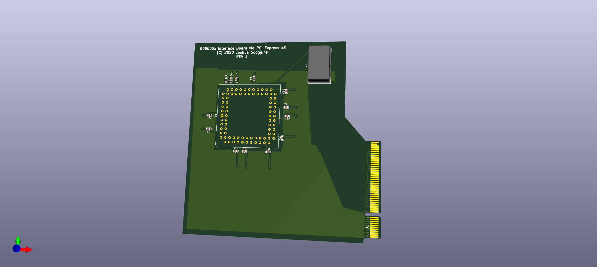
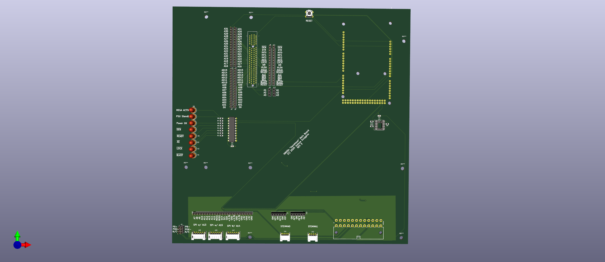
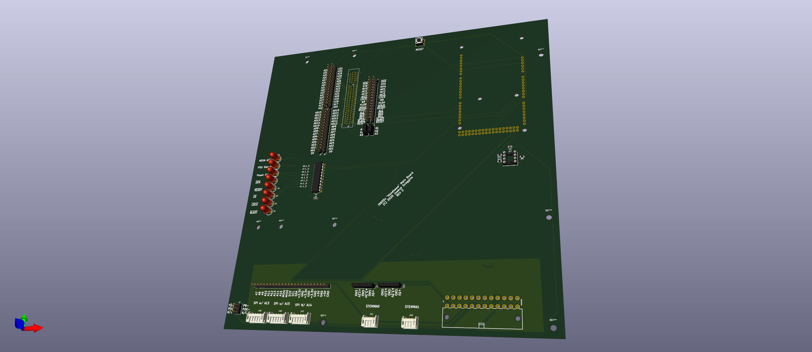
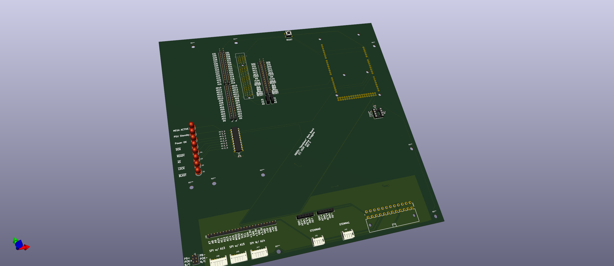

# i960 Sx Kicad Projects

As of the time of writing this file there are two projects in here:

- SXMainBoard 
- i960SxBreakoutBoard

The mainboard accepts the custom i960SxBreakoutBoard in a PCI-Express 8x slot
(IT IS NOT ELECTRICALLY PCI-EXPRESS AT ALL)

The main board accepts a mega 2560 so I can analyze the signals coming out of
the i960Sx. I am using a sparkfun ATX connector becuase the i960Sx pulls a
minimum of 3.8A @ 5V! It is a real pig of a CPU at a paltry 10-20Mhz. It runs
_HOT_!

All of the signals are routed into the Mega2560 so I can also use it to emulate
a normal system. I can also mount the board in a standard PC case so that's
really nice.

A special thanks to https://github.com/sparkfun/StupidArduinos (Thanks
Sparkfun, you ROCK!) for publishing the source code to their Pro Micro-ATX. I
lifted the Micro ATX board design directly from it. 

One final thing, if you are curious and get the boards printed please note that they are four layer boards. 
So your choice of pcb manufacturers is quite limited. 
